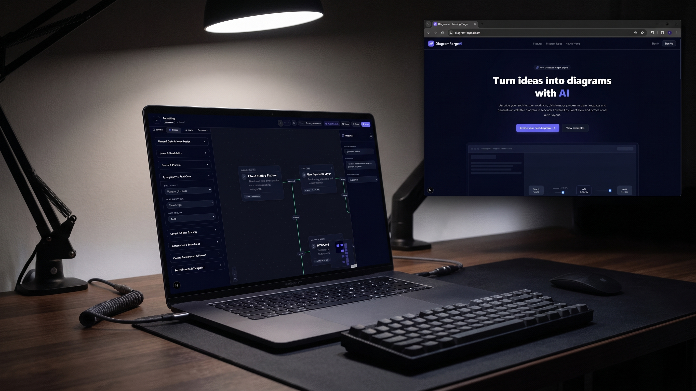

# Diagrammi

Diagrammi is an AI-assisted diagramming tool for generating and editing software architecture diagrams (C4 model, UML) from natural-language prompts or PlantUML. It combines a React Flow canvas with an LLM backend to generate, refine, and export professional diagrams.


## Key Features

- **AI diagram generation** — describe a system in plain language and generate a diagram via an OpenAI-compatible API (`lib/ai/`)
- **Interactive canvas** — pan/zoom/edit diagrams built on [@xyflow/react](https://reactflow.dev), with themed edges and custom node types (Actor, Entity, Note, Standard, UML Class, Use Case)
- **PlantUML import** — parse existing `.puml` diagrams into the visual canvas (`lib/diagram/plantuml-parser.ts`)
- **Auto-layout** — automatic node arrangement via `dagre`
- **Export** — export diagrams to images via `html-to-image`
- **Sharing** — shareable, tokenized read-only diagram links (`app/share/[token]`)
- **Authoring guidelines engine** — enforces C4/UML visual conventions consistently (`lib/diagram/DIAGRAM_RULES.md`, `guidelines.ts`)
- **Auth & persistence** — Supabase-backed accounts and saved diagrams/workspaces

## Project Structure

```
Diagrammi/
├── app/
│   ├── api/
│   │   ├── generate/         # AI diagram generation endpoint
│   │   ├── refine/           # AI diagram refinement endpoint
│   │   ├── diagrams/         # CRUD for saved diagrams
│   │   └── share/            # Share-link creation/resolution
│   ├── dashboard/            # User's diagram list
│   ├── workspace/[id]/       # Main diagram editor
│   ├── share/[token]/        # Public read-only diagram view
│   ├── login/ signup/ forgot-password/ reset-password/
│   └── settings/
├── components/
│   └── workspace/
│       └── canvas/
│           ├── nodes/        # ActorNode, EntityNode, StandardNode, UmlClassNode, UseCaseNode, NoteNode
│           └── edges/        # ThemedEdge
├── lib/
│   ├── ai/                   # provider.ts, prompts.ts, schemas.ts — LLM integration
│   ├── diagram/               # layout.ts, export.ts, plantuml-parser.ts, guidelines.ts
│   └── supabase/             # Supabase client (browser/server)
├── types/                    # Shared TypeScript types (diagram.ts)
└── middleware.ts             # Auth/session middleware
```

## Getting Started

### Prerequisites

- Node.js 20+
- A [Supabase](https://supabase.com) project
- An OpenAI-compatible API key (OpenAI, or any compatible provider)

### Environment Variables

Copy `.env.example` to `.env.local` and fill in the values:

```bash
cp .env.example .env.local
```

| Variable | Description |
|---|---|
| `NEXT_PUBLIC_SUPABASE_URL` | Supabase project URL |
| `NEXT_PUBLIC_SUPABASE_ANON_KEY` | Supabase anon/public key |
| `SUPABASE_SERVICE_ROLE_KEY` | Supabase service role key (server-only, never expose client-side) |
| `AI_API_KEY` | API key for the AI provider |
| `AI_MODEL` | Model name (default `gpt-4o-mini`) |
| `AI_BASE_URL` | OpenAI-compatible API base URL |

### Installation & Development

```bash
npm install
npm run dev        # http://localhost:3000
```

### Build & Run

```bash
npm run build
npm start
```

### Linting

```bash
npm run lint
```
